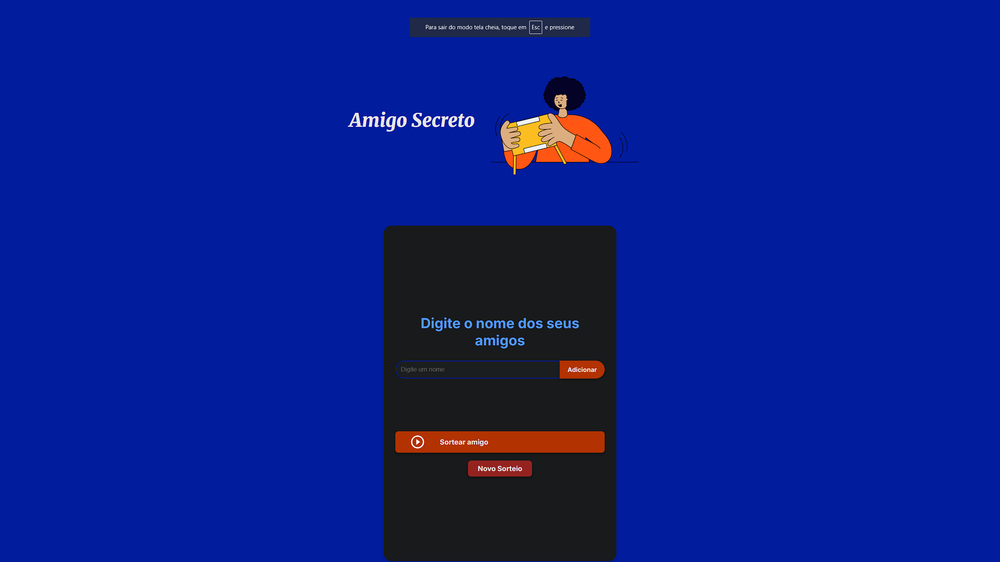

# 🎁 Amigo Secreto - Oracle One

Este é um projeto do **Challenge Oracle One**, onde desenvolvemos um aplicativo simples para sortear um **Amigo Secreto**.

## 📌 Funcionalidades
✅ Adicionar nomes à lista  
✅ Impedir nomes duplicados  
✅ Exibir a lista de amigos cadastrados  
✅ Sortear um amigo aleatoriamente  
✅ Remover nomes individualmente  
✅ Reiniciar o sorteio  
✅ Design aprimorado e responsivo  

## 🚀 Como usar?
1. Digite um nome no campo e clique em **Adicionar**.
2. Após adicionar todos os participantes, clique em **Sortear amigo**.
3. O nome sorteado aparecerá na tela! 🎉
4. Se quiser fazer outro sorteio, clique em **Novo Sorteio**.
5. Para remover um nome, clique no ❌ ao lado do nome na lista.

## 📸 Imagem do Projeto

## 🛠 Tecnologias Utilizadas
- HTML5
- CSS3
- JavaScript (Vanilla)

## 📂 Como rodar o projeto?
1. Clone este repositório: https://github.com/AlgumaCoisa2/amigo-secreto-oracle-one.git
2. Abra a pasta no **VS Code** ou qualquer editor de sua escolha.
3. Execute o arquivo **index.html** no navegador.

## 🌐 Publicação (GitHub Pages)
🔗 [Acesse o projeto online aqui](#) *(adicione o link do GitHub Pages quando publicarmos)*

---
Projeto desenvolvido como parte do **Challenge Oracle ONE - Alura & Oracle**.  
Feito com ❤️ por Francisco Ferreira.
